# Race Timing App — Product & Technical Blueprint (MVP)

**Status:** Draft for review
**Date:** August 27, 2026
**Owner:** Kshitish

---

## 1. Problem Statement

Race organisers currently rely on manual timing (stopwatches + spreadsheets) or expensive third-party timing vendors to capture checkpoint splits and finish times. Manual timing is error-prone and slow to compile; commercial timing vendors are costly and overkill for small-to-mid-size community races (50–500 participants), especially trail and mountain events where checkpoints are remote and connectivity is unreliable. Organisers need a lightweight, self-serve tool that lets volunteers capture accurate timestamps at checkpoints — with or without signal — and lets the organiser compile and export clean results shortly after the race finishes.

## 2. Goals

- Let a volunteer capture a participant's checkpoint time in under 3 seconds via QR scan, with a manual fallback.
- Guarantee zero data loss when a checkpoint has no connectivity — all scans are captured locally and sync automatically once online.
- Give organisers a self-serve way to set up a race (checkpoints, volunteers, participants) in under 30 minutes.
- Produce exportable, checkpoint-by-checkpoint results within 15 minutes of the last finisher.
- Support multiple organisers on one platform, each fully isolated from the others' data. *(A backend/data-model goal for v0 — tenant isolation enforced in the data layer, not a frontend feature; see the Non-Goals note below.)*
- Monetize via a simple usage-based model: free up to 50 participants per race, $1/participant beyond that. *(Also backend-only for v0 — usage is computed and stored; no purpose-built billing UI/feature is a v0 goal, see §11.)*

## 3. Non-Goals (v1)

- **Participant registration & entry-fee payments (for v1)** — this product times races, it doesn't sell race entries in the MVP. Participants are added by the organiser (manually, CSV import, or import from an existing registration system); collecting registration fees from runners is out of scope for now. This is explicitly on the roadmap (see §6 Future Considerations) — it's deferred, not ruled out, because it introduces a second, materially different payment problem (collecting money on an organiser's behalf) on top of the platform's own usage billing.
- **Walk-up / day-of registration** — confirmed decision: only pre-registered participants (an existing `Profile` + `Participant` record created before race day) are valid. There is no on-the-spot registration path in v0; a scan that doesn't match a pre-registered participant is handled via manual recording, not a walk-up flow (see §9).
- **Integrating with an existing external registration system via API/webhook** — confirmed not in v0. Participants are added via manual entry or CSV import only; a live sync with an external registration/CMS system is a future consideration if it becomes worth the integration effort.
- **Public/spectator-facing live results or tracking** — v1 results are for the organiser to review and export; a public live leaderboard is a future consideration.
- **RFID/chip timing hardware integration** — v1 is QR-code + manual entry only. Hardware integration is architecturally anticipated but not built.
- **Participant-facing login/portal** — participants receive a QR code by email; they don't log into the product in v1. Viewing personal results/certificates is a future consideration.
- **Automated Stripe billing** — v1 tracks and displays usage/billable participants; actually charging cards can start as manual invoicing, with automated billing as a fast-follow.
- **Dedicated frontend/UI for multi-tenancy management or billing/usage display** — both multi-organiser isolation and the usage-based pricing model (§2 Goals) are backend/data-model concerns for v0, not feature work: isolation is enforced in the query layer, and usage is computed and stored in `BillingUsageRecords`. Any visibility into either is via Django Admin (already built for CRUD — see §6), not a purpose-built screen or dashboard.

## 4. Personas

- **Organiser** — creates and configures races, invites volunteers, adds participants, reviews and exports results, sees billing status. May belong to an organisation with co-admins.
- **Volunteer** — logs in via a magic link, is assigned to one or more checkpoints on one or more races, scans/records times at their checkpoint(s).
- **Participant** — never logs in. Receives a QR code by email and is scanned at checkpoints. Their record lives in the system as the subject of timing data.

## 5. User Stories

### Organiser

- As an organiser, I want to create a race with a name, date, and start time so I can set up timing ahead of race day.
- As an organiser, I want to define an ordered list of checkpoints (e.g., Start, CP1, CP2, Finish) for a race so volunteers know what to log and results can be split correctly.
- As an organiser, I want to add participants individually or via CSV import so each gets a bib number and a profile in the system.
- As an organiser, I want each participant's QR code emailed to them automatically when they're added, so I don't have to distribute codes manually.
- As an organiser, I want to invite volunteers by email and assign each to a specific race and checkpoint, so responsibilities are unambiguous on race day.
- As an organiser, I want a shareable volunteer login link (not just email) so I can send it over WhatsApp or text to volunteers who confirm late.
- As an organiser, I want to see scan activity across checkpoints as it syncs in, so I can spot a checkpoint that's gone quiet.
- As an organiser, I want to manually add or correct a timing record so I can fix a missed or misread scan.
- As an organiser, I want to export compiled results (bib, name, per-checkpoint splits, finish time) as CSV so I can publish or hand off official results.
- As an organiser, I want to see my current participant count against the free-tier threshold and my estimated bill, so there are no billing surprises.
- As an organiser running races under my organisation, I want my races and data fully separated from any other organiser on the platform.

### Volunteer

- As a volunteer, I want to log in via a magic link sent to my email (or forwarded to me on WhatsApp) without setting a password, so getting started takes seconds.
- As a volunteer, I want to land directly on my assigned checkpoint's scan screen after login, so I don't need to navigate a menu.
- As a volunteer, I want to scan a participant's QR code with my phone camera and get instant confirmation of who was logged, so I can keep the line moving.
- As a volunteer, I want to manually enter a bib number and time when a code is unreadable, damaged, or a runner has no phone, so no one is missed.
- As a volunteer, I want scanning to keep working with zero signal, so a checkpoint deep on a trail isn't blocked.
- As a volunteer, I want queued scans to sync automatically the moment I get signal, without any extra action from me.
- As a volunteer, I want to see a live count of scans not yet synced, so I trust nothing is being lost.
- As a volunteer, I want a duplicate scan of the same runner at my checkpoint to be flagged, not silently dropped or silently duplicated, so results stay clean either way.

### Participant

- As a participant, I want to receive my personal QR code by email after I'm registered, so I'm ready to be scanned on race day.
- As a participant, I want my QR code to work whether I show it on my phone screen or a printed copy, so I'm not dependent on battery life mid-race.

## 6. Requirements

### P0 — Must-Have (MVP)

| # | Requirement | Acceptance Criteria |
|---|---|---|
| 1 | Organiser accounts, scoped to an Organisation (tenant) | Given two organisers in different organisations, when either queries races/participants, then each sees only their own organisation's data |
| 2 | Race CRUD (name, date, start time, timezone, status) | Organiser can create, edit, and archive a race from the web/admin UI |
| 3 | Checkpoint CRUD per race, with ordering | Checkpoints can be added, reordered, and typed as start / intermediate / finish |
| 4 | Participant creation (manual + CSV import), linked to a reusable Profile | Adding a participant creates or reuses a Profile (deduped by email) and a per-race Participant record with a bib number |
| 5 | Auto-generated unique QR code per Profile, emailed on creation | Given a new participant is added, when saved, then an email with their QR code is sent within 1 minute |
| 6 | Volunteer invite + magic-link auth, scoped to race + checkpoint | Given a volunteer clicks a valid magic link, when it hasn't expired or been used past its allowed window, then they land on their assigned checkpoint's scan screen without a password |
| 7 | Magic link also available as a copyable/shareable URL | Organiser can copy the same link an invited volunteer would receive, to forward via WhatsApp/SMS |
| 8 | Mobile-optimized scan screen: camera QR scan + manual entry fallback | Both paths write a Timing record with the same required fields |
| 9 | Offline scan capture with local queue and auto-sync | Given the device has no connectivity, when a volunteer scans or manually enters a time, then the record is saved locally and shows as "pending sync"; when connectivity returns, then it syncs automatically without user action |
| 10 | Idempotent sync (no duplicate rows from retries) | Re-submitting the same locally-queued scan (e.g., after a dropped connection mid-sync) never creates a second server-side row |
| 11 | Timings log with full audit fields | Each Timing record stores checkpoint, participant, device-captured timestamp, server-received timestamp, mode (qr/manual), success flag, and the recording volunteer |
| 12 | Duplicate-scan detection | A second scan of the same participant at the same checkpoint within a configurable window is flagged, not silently discarded or blindly duplicated into results |
| 13 | Results compilation | Per participant: ordered checkpoint timestamps, computed splits, and total elapsed time from start |
| 14 | CSV export of results | Organiser can export a race's results as CSV, including any manually-corrected entries |
| 15 | Participant-count metering per race | System tracks participant count per race in real time and computes billable participants (count − 50, floored at 0) |
| 16 | Consistent behavior on Android and iOS | The PWA's scan flow (camera QR scan, manual entry, offline queueing, sync) is tested and works the same way on Android Chrome and iOS Safari — no Android-only or iOS-only path |

**Confirmed design decisions (from review):**
- **One QR code per person, not per race.** The QR encodes only the `Profile.qr_code_uuid`. It's generated once and reused on every race that profile enters. A race entry (`Participant`) is a thin metadata layer on top of the profile — bib number, category, status — not a second identity or a second code. A volunteer's scan resolves to a profile, and the app matches that profile against the *current race's* cached roster to find the relevant `Participant` record.
- **Organiser CRUD stays minimal for v1.** Given the "very basic CRUD" bar for race setup, we recommend building the organiser-facing race/checkpoint/participant/volunteer management as a customized **Django Admin** interface rather than a bespoke React web app. Django Admin gives list/create/edit/delete, search, and CSV import (via `django-import-export` or similar) essentially for free, which is the right amount of tooling for v1 and can be replaced with a purpose-built dashboard later without touching the API the mobile PWA depends on.

### P1 — Nice-to-Have (Fast Follow)

- Bulk CSV import with row-level validation and an error report.
- Multiple volunteers per checkpoint with per-device attribution.
- Organiser-facing live/near-live results dashboard (not public).
- Co-admin roles within an organisation (owner / admin / staff).
- Self-serve QR code resend for a participant who lost their email.
- Configurable duplicate-scan window and auto-resolution rules per race.
- DNS/DNF/cutoff marking that feeds into results computation.
- Consent gate on cross-organisation profile reuse — not needed in v0. Until this is built, v0 dedupes and pre-fills a profile's shareable fields (`full_name`, `email`, `date_of_birth`, `gender`, `itra_id`) across organisations by default whenever the email matches; `phone` and emergency-contact fields stay private to the organisation(s) actually raced with either way, since that's just how those fields are queried/exposed, not something consent-gating changes. The `Profiles.cross_org_sharing_consent_at` field (§8) is reserved for whenever this gate is actually built.

### P2 — Future Considerations

**Participant app.** A second mobile app/experience, for participants rather than volunteers, enabling **participant-initiated scans**: instead of (or in addition to) a volunteer scanning the runner's code, the participant scans a code posted at the checkpoint. This makes checkpoints self-service and reduces volunteer staffing needs, but it's a materially bigger build than v1:
  - **Authentication: confirmed as magic link**, matching the volunteer/organiser pattern rather than a password. Concretely, this means extending the existing `MagicLinks` table with a `participant_login` purpose and a `profile_id` FK alongside the existing `user_id` FK, so a magic link can authenticate either a `User` or a `Profile` — avoiding a full merge of the two tables while still reusing the same login mechanism end to end.
  - Requires each `Checkpoint` to carry its own scannable code (`self_scan_code`, already reserved on `Checkpoints` — see §8).
  - `Timings.recorded_by_user_id` currently assumes a volunteer initiated the scan; a self-scan mode needs a generic "who initiated this" concept (volunteer vs. participant) rather than a single volunteer-only foreign key.
  - Once participants can log in, the app can expand into **My Races** (history across events), **My Results** (splits/certificates), **My Profile** (self-service editing of the `Profile` record), and integration with **ITRA Index** (pulling/displaying a runner's official index score). Confirmed out of scope for v0; whether ITRA exposes a usable API or needs a negotiated data-sharing arrangement is a research item to resolve if/when this is actually scoped, not a v0 blocker.

**Flexible checkpoint sequencing.** Today's schema (`Checkpoints.sequence_order` + `type`) already supports the default **strict order** case (Start → CP1 → CP2 → … → Finish, validated in that order). A future **"any order between Start and Finish"** mode — useful for loop courses or venues with several equally-valid intermediate checkpoints — needs: (a) a per-race toggle (e.g., `Races.checkpoint_sequence_mode`: `strict` / `any`, cheap to add now with `strict` as the only implemented behavior), and (b) results-compilation logic that stops treating out-of-order intermediate scans as anomalies when the toggle is set to `any`.

**Results normalization built into the platform, not just an export flourish.** Age/gender-normalized (handicap-style) grading should be computed as part of core results compilation, not bolted on at export time. This needs a `GradingTables`-style entity (age-band + gender → coefficient, versioned so historical results don't shift if coefficients are later revised) feeding into the results-compilation step alongside raw splits.

**Standard export formats.** Confirmed requirement for a future release: results export supports the ITRA and UTMB standard result-submission formats, in addition to CSV — the specs are publicly available, so this is scoped as a straightforward additional-formatter build rather than a research item. Recommend building the export layer as a pluggable formatter interface from day one (CSV is just the first formatter) so adding the ITRA/UTMB formatters later doesn't mean rewriting the export path.

**GPX and location features**, in two distinct stages of ambition:
  - *Stage A — checkpoint-scan-based progress*: infer and visualize a participant's progress along the course using their checkpoint scan sequence plus an uploaded route (a `RaceRoutes` entity: race, GPX file, distance, elevation profile). This is a relatively cheap extension of what v1 already captures.
  - *Stage B — true real-time GPS tracking*: continuous location updates from a participant's phone, which requires the participant app (above) running with background location permission, plus meaningfully more backend/infra (ingesting and storing a location stream, not just point-in-time scans). Don't conflate the two when scoping this later — Stage A is a natural fast-follow, Stage B is a much larger undertaking.

**Registration, eventually.** Building race registration (public signup forms, entry management) into the platform is on the roadmap. This is a different payment problem than the organiser's usage billing (§11): it means collecting entry fees *on the organiser's behalf* and routing funds to them, which typically needs a marketplace-style payment setup (e.g., Stripe Connect) rather than a simple metered subscription. Confirmed: the payment-rails approach for this will be scoped during v2 planning, worth treating as its own initiative rather than an extension of `BillingUsageRecords`.

**Other future items:** automated Stripe metered billing, replacing manual invoicing — confirmed as a v2 item, not a v0/v1 fast-follow (see §11); RFID/chip timing hardware as an additional `Timings.mode`; public live results / spectator tracking view; multi-language support for volunteer/organiser UI.

## 7. System Architecture

### Recommended stack

- **Backend:** Python + Django + Django REST Framework, MySQL. Celery + Redis for async work (email sending, sync post-processing, billing recomputation).
- **Frontend: PWA (React + Vite), not React Native — a firm recommendation, not an open question.** One codebase, installable via "Add to Home Screen" with no app-store review cycle (important both for shipping speed and because volunteers are one-time or occasional users who shouldn't have to install a native app just to work one event), and a service worker + IndexedDB gives genuine offline capability. The one real technical risk is that Safari/WebKit has never implemented the Web Background Sync API, so the design must not depend on it: sync is triggered by an `online` event listener plus a periodic in-foreground timer (works identically on Android and iOS) rather than the browser's native background-sync API, which only Chrome/Android would honor anyway. With that design choice, there's no functional gap between platforms — a volunteer has the app open while working a checkpoint either way. Camera access via `getUserMedia` is solid on both platforms as of current iOS/Safari versions. Net recommendation: build the PWA, treat camera-library selection and the online/foreground sync strategy as a one-to-two-day validation spike at the *start* of Phase 1 (not a blocking decision), and keep a Capacitor wrap of the same React codebase as the fallback path if that spike turns up a real blocker — which we don't expect.
- **Local storage (offline queue):** IndexedDB via Dexie.js (or SQLite if later wrapped in Capacitor/React Native).
- **QR scanning:** a camera-based QR library (e.g., a ZXing- or html5-qrcode-based scanner) running client-side, no server round-trip needed to decode.
- **Auth:** signed, expiring tokens (magic links) — no passwords for volunteers; organisers can use magic link or standard email/password.
- **Organiser CRUD:** a customized Django Admin, not a separate hand-built web app, given the "very basic CRUD" bar for v1 race setup (see §6 confirmed decisions). It talks to the same MySQL database the API serves, so nothing about the mobile PWA's contract depends on this choice.
- **Cross-platform parity:** because the PWA is the only client, "works alike on Android and iOS" is a testing discipline, not a build choice — the same codebase ships to both, but camera access and install-to-homescreen behavior still need explicit test coverage on both platforms during the Phase 1 spike above before v1 ships.

### High-level flow

```mermaid
flowchart LR
    subgraph Organiser Web App
        A[Create race, checkpoints, participants] --> B[(MySQL via Django API)]
        A --> C[Invite volunteers]
    end

    C --> D[Volunteer gets magic link\nemail / WhatsApp / SMS]
    D --> E[Volunteer PWA\nlogs in, no password]

    subgraph Checkpoint - offline capable
        E --> F[Scan QR / manual entry]
        F --> G[(Local queue\nIndexedDB)]
        G -->|connectivity available| H[Bulk sync API\nidempotent by client_event_id]
    end

    H --> B
    B --> I[Results compilation]
    I --> J[CSV export]
    B --> K[Participant profile QR\nemailed on creation]
```

## 8. Database Schema (MySQL / Django models)

All tenant-scoped tables carry a path back to `Organisation`, either directly or via `Race`, so every query can be filtered to the requesting organiser's data.

**Organisations** — the tenant
- `id` PK
- `name`, `slug` (unique)
- `billing_email`
- `stripe_customer_id` (nullable)
- `created_at`, `updated_at`

**Users** — anyone who logs in (organiser staff *and* volunteers share this table; role is contextual, assigned via join tables below)
- `id` PK
- `email` (unique), `name`, `phone` (nullable — used for WhatsApp/SMS link sharing)
- `created_at`, `updated_at`

**OrganisationMembers** — organiser-side roles
- `id` PK
- `organisation_id` FK → Organisations
- `user_id` FK → Users
- `role` (owner / admin / staff)

**MagicLinks** — issued login tokens (kept as their own table for auditability and to allow several outstanding links per user)
- `id` PK
- `user_id` FK → Users
- `token_hash` (store a hash, never the raw token)
- `purpose` (organiser_login / volunteer_login)
- `race_id` FK → Races (nullable; volunteer links are scoped to a race)
- `expires_at`, `used_at` (nullable), `created_at`

**Races**
- `id` PK
- `organisation_id` FK → Organisations
- `name`, `slug`
- `event_date`, `start_time`, `timezone`
- `status` (draft / active / completed / archived)
- `participant_count_cache` (denormalized int, kept in sync on Participant create/delete — speeds up billing checks)
- `checkpoint_sequence_mode` (`strict` / `any`, default `strict`) — cheap to add now even though only `strict` is enforced by v1 logic; avoids a migration when "any order" ships later
- `created_at`, `updated_at`

**Checkpoints**
- `id` PK
- `race_id` FK → Races
- `name` (e.g. "Start", "CP1 – Aid Station", "Finish")
- `sequence_order` (int)
- `type` (start / checkpoint / finish)
- `gps_lat`, `gps_lng` (nullable — reserved for P2 GPS-proximity feature)
- `self_scan_code` (nullable, unused in v1) — reserved for the future participant-app mode where a runner scans a code posted *at* the checkpoint rather than a volunteer scanning the runner

**RaceVolunteers** — join table mapping a volunteer (User) to a race and a checkpoint
- `id` PK
- `race_id` FK → Races
- `checkpoint_id` FK → Checkpoints
- `user_id` FK → Users
- `invited_at`, `accepted_at` (nullable)

*Design note: the brief describes checkpoints as "mapped to volunteer and race." We recommend keeping that mapping in this separate join table rather than as columns on `Checkpoints` directly — it lets a checkpoint have more than one volunteer (P1) and lets a volunteer be reassigned without mutating the checkpoint record.*

**Profiles** — source of truth for a person's identity, reusable across races and (by design) across organisations
- `id` PK
- `email` (unique — the dedup key)
- **Shareable core identity** (reused/pre-filled across organisations by default in v0 whenever the email matches — no consent gate yet, see §6 P1): `full_name`, `date_of_birth` (nullable), `gender` (nullable), `itra_id` (nullable)
- **Organisation-private fields** (never surfaced to an organisation the profile hasn't itself registered with, regardless of the consent gate): `phone` (nullable), `emergency_contact_name`, `emergency_contact_phone` (nullable — latest known, pre-filled but editable per race)
- `qr_code_uuid` (unique) — generated once, reused on every race the person enters, matching "a profile QR code sent by email"; this is deliberately the **only** QR code tied to a person — never regenerated per race
- `cross_org_sharing_consent_at` (nullable datetime, reserved/unused in v0) — for the future P1 consent gate: will record when consent was captured for this profile's core identity fields to be reused by a different organisation. Not checked by any v0 logic.
- `created_at`, `updated_at`

*Forward-compat note: the participant app's login is confirmed as magic-link auth (same mechanism as volunteers/organisers), via a `participant_login` purpose and a `profile_id` FK added to `MagicLinks` — see §6 Participant App. Not needed for v1; called out so the v1 schema isn't accidentally built in a way that forecloses it.*

**Participants** — a Profile's entry into one specific Race
- `id` PK
- `race_id` FK → Races
- `profile_id` FK → Profiles
- `bib_number`
- `category` (per-race only — not stored on Profile)
- `status` (registered / checked_in / dnf / dns / finished)
- `created_at`, `updated_at`
- Unique constraint: (`race_id`, `profile_id`) — a profile enters a race at most once
- Unique constraint: (`race_id`, `bib_number`)

**Timings**
- `id` PK
- `checkpoint_id` FK → Checkpoints
- `participant_id` FK → Participants
- `recorded_by_user_id` FK → Users (nullable)
- `device_id` (client-generated identifier, for audit)
- `client_event_id` (UUID, generated on-device at capture time)
- `timestamp` (device-captured local time, converted to UTC for storage, trusted as-is with no offset correction — see §9)
- `server_received_at` (set on sync)
- `mode` (qr / manual)
- `success` (boolean — false for a failed/misread attempt logged for audit)
- `is_duplicate` (boolean, set by the dedup check described in §9)
- `notes` (nullable)
- `created_at`
- Unique constraint: (`client_event_id`) — this is the idempotency key that makes sync retries safe
- Index: (`checkpoint_id`, `participant_id`) — used for results compilation and duplicate-window checks

*Forward-compat note: `recorded_by_user_id` assumes a volunteer (a `User`) always initiates the scan — true for v1. Participant self-scan (future) means the initiator could instead be the participant themselves; plan to generalize this to an `initiated_by_type` (volunteer / participant) plus the corresponding id, rather than reusing `recorded_by_user_id` for a participant.*

**BillingUsageRecords** — usage metering per race
- `id` PK
- `race_id` FK → Races
- `organisation_id` FK → Organisations (denormalized for reporting)
- `participant_count` (snapshot)
- `billable_participants` = `max(0, participant_count − 50)`
- `unit_price` (decimal, default $1.00 — kept per-organisation-overridable for future custom pricing)
- `amount_due`, `currency`
- `status` (pending / invoiced / paid / waived)
- `computed_at`, `invoice_reference` (nullable)

## 9. Offline-First Sync Design

This is the load-bearing requirement of the whole product, so it gets its own section.

**What's cached locally, on volunteer login (while online):**
- The assigned race's checkpoint(s).
- The race's participant roster (bib, name, profile QR UUID) — needed so a scan can show an immediate "Jane Doe, Bib #142" confirmation even with zero signal.
- A long-lived signed session token exchanged from the magic link, so the volunteer stays logged in for the duration of the event without needing connectivity to re-authenticate. (JWT verification is stateless, so expiry can be checked entirely client-side; revocation is only checked the next time the device is online.)

**On every scan or manual entry:**
1. The app looks up the scanned/entered bib against the locally cached roster and shows an instant confirmation. If the bib isn't in the cached roster, the scan is still logged (`success=false`, noted as unmatched) rather than silently dropped — v0 deliberately doesn't build a dedicated resolution workflow for this case; since only pre-registered participants are valid (§3) it should be rare, and the volunteer's manual-entry fallback (requirement #8) already covers it in practice.
2. A `Timing` row is written to the local queue with a client-generated `client_event_id`, the device-captured timestamp, checkpoint, mode, and success flag.
3. The UI shows a running count of scans pending sync.

**Sync:**
- Triggered automatically on connectivity change (service worker background sync) and periodically while online.
- Sent as a batch to a bulk-sync endpoint; the server upserts on `client_event_id` (`INSERT ... ON DUPLICATE KEY UPDATE`), so a retried or partially-acknowledged batch never creates duplicate rows.
- On success, the client marks the local rows synced and decrements the pending counter.

**Duplicate scans:** if the same participant is scanned at the same checkpoint twice within a configurable window (e.g., 120 seconds), the second row is stored (not discarded) but flagged `is_duplicate`. Results compilation uses the first non-duplicate successful row per (checkpoint, participant) by default; an organiser can review and override flagged duplicates in case a re-scan was actually a correction.

**Clock accuracy:** confirmed decision — trust the device's own local clock as-is, with no custom offset-correction logic. Phones are assumed to be carrier/network-time-synced, which is accurate enough for checkpoint splits; this removes what would otherwise be an engineering spike. (If a specific device is later found to have drifted — e.g., a volunteer with network time sync disabled — that shows up as an outlier in results review and gets corrected manually like any other bad entry, rather than the system trying to auto-detect it.)

## 10. Multi-Organiser & Tenancy Model

- Every `Race`, and everything hanging off it (`Checkpoints`, `Participants`, `Timings`, volunteer assignments), belongs to exactly one `Organisation`. MySQL doesn't give row-level security the way some other databases do, so isolation is enforced in the application layer: a base queryset/manager mixin that always filters by the requesting organisation, backed by tests that assert cross-tenant queries return nothing.
- `Profiles` are the one entity that's intentionally **not** organisation-scoped — a runner's identity and QR code are meant to be reused across races and across organisers, avoiding duplicate profiles for the same person. An organisation only ever sees the `Participant` rows (race entries) that belong to its own races, never another organiser's history for the same profile. What *is* field-scoped, in v0 by default: when a different organisation registers a profile that already exists elsewhere, only the core identity fields — `full_name`, `email`, `date_of_birth`, `gender`, `itra_id` — are shared or pre-filled; `phone` and emergency-contact details stay private to the organisation(s) the participant has actually raced with. A consent gate in front of this reuse (requiring explicit opt-in before it happens at all) is a confirmed P1, not v0 — see §6. In practice, since walk-ups aren't permitted (see §3), this only ever applies to participants who have genuinely registered somewhere.
- `OrganisationMembers` allows more than one person to administer an organisation (useful once co-admins are needed — flagged as P1, but the schema supports it from day one).

## 11. Payment / Billing Model

- Pricing: free up to 50 participants per race; $1 per participant beyond that, computed per race (not pooled across an organiser's races), via `BillingUsageRecords`.
- `Race.participant_count_cache` is updated on every `Participant` create/delete so the free-tier check is cheap; a nightly reconciliation job recomputes it from source to catch drift.
- v0/v1: usage/billable-participant counts are computed and stored (`BillingUsageRecords`), viewable via Django Admin — no purpose-built billing dashboard is being built for v0 (see §3 Non-Goals). Actual payment collection is manual (an emailed statement / manual invoice) — this is confirmed for the first version, not an open decision.
- v2/v3: wire `BillingUsageRecords` into Stripe's metered billing — one subscription item per organisation, usage records pushed as races cross the threshold — to remove the manual step. Deliberately not scoped as an immediate v1 fast-follow.

## 12. API Surface (indicative)

| Endpoint | Method | Purpose |
|---|---|---|
| `/api/auth/magic-link/request` | POST | Organiser or volunteer requests a login link |
| `/api/auth/magic-link/consume` | POST | Exchange a magic-link token for a session |
| `/api/races` | GET/POST | List/create races (organisation-scoped) |
| `/api/races/:id/checkpoints` | GET/POST | Manage checkpoints for a race |
| `/api/races/:id/participants` | GET/POST | List/add participants (supports CSV import) |
| `/api/races/:id/volunteers` | GET/POST | Invite/assign volunteers to checkpoints |
| `/api/timings/bulk-sync` | POST | Idempotent batch upload of queued scans (keyed on `client_event_id`) |
| `/api/races/:id/results` | GET | Compiled results (splits + elapsed time) |
| `/api/races/:id/results/export?format=csv` | GET | Results export; `format` designed as an extension point for future `itra`/`utmb` formatters, CSV-only in v1 |

*Billing/usage data has no v0 endpoint — it's a backend/data concern (§2, §3, §11), read directly via Django Admin. Add `/api/races/:id/billing` only if/when a purpose-built organiser dashboard (§6 P1) is actually built.*

## 13. Success Metrics

**Leading (days–weeks):**
- First-attempt scan success rate ≥ 95%.
- Median time from offline scan capture to server-visible sync ≤ 30 seconds after connectivity returns.
- ≥ 90% of invited volunteers complete at least one scan during their assigned event.
- Organiser can produce a CSV export within 15 minutes of the last finisher's scan.

**Lagging (weeks–months):**
- ≥ 50% of organisers who run one race run a second race on the platform within 90 days.
- % of races that cross the 50-participant free threshold (proxy for revenue potential).
- Monthly recurring revenue from per-participant billing.
- Near-zero support tickets tied to lost or incorrect timing data.

## 14. Open Questions

All ten items raised in the previous review round are now decided and folded into the relevant sections above (cross-org profile sharing → §6/§8/§10; unmatched codes and clock accuracy → §9; PWA vs. native → §7; walk-ups and external-registration integration → §3; ITRA/UTMB export and ITRA Index → §6; registration payment rails and participant-app auth → §6). What's genuinely still open:

- **Exact consent-capture wording/UX** — the cross-organisation sharing consent gate itself is now confirmed P1, not v0 (§6). Whenever it is built, where and how consent is actually presented and recorded (a checkbox on whatever registration form feeds the organiser's CSV import, an organiser attestation during manual add, etc.) still needs designing. *(product)*
- **Phase 1 platform-parity spike outcome** — the PWA recommendation in §7 assumes current-generation iOS Safari handles camera + foreground/online-triggered sync reliably; this is treated as validated-by-design rather than untested, but the actual spike at the start of Phase 1 is the real confirmation. *(engineering)*

## 15. Timeline & Phasing

- **Phase 1 — Core MVP (~6–8 weeks):** organisation/race/checkpoint CRUD (via Django Admin), participant creation + QR email, volunteer magic-link auth, offline scan capture + idempotent sync, CSV export, usage metering (backend-tracked, viewable via Django Admin — no dedicated UI).
- **Phase 2 — Fast follow (~3–4 weeks):** bulk CSV import with validation, multi-volunteer checkpoints, organiser results dashboard, co-admin roles. (Automated billing is explicitly *not* in this phase — see below.)
- **Phase 3 (v2) — Future:** participant app (magic-link auth, self-scan, My Races/My Results/My Profile, ITRA Index integration), flexible checkpoint sequencing, in-platform age/gender grading, ITRA/UTMB export formats, GPX route upload and scan-based progress visualization, automated Stripe metered billing, and scoping the payment rails (e.g., Stripe Connect) that in-app registration will need.
- **Phase 4 (v3) — Longer-term:** true real-time GPS tracking, in-app registration and entry-fee collection (built on the payment rails scoped in v2), public live results, RFID/chip hardware integration.

No hard external deadline is specified; the natural test bed is the next scheduled race on the organiser's own calendar, which should drive the Phase 1 target date.
